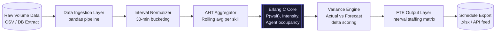

# WFM Forecasting Calculator

> Erlang C-powered FTE demand forecasting system that delivers sub-8% variance against actual staffing requirements, replacing manual spreadsheet forecasting for contact center operations.

---

## Executive Summary

Contact center staffing operated on manual interval-based forecasting, producing variance rates of 18–25% against actual demand — a direct driver of SLA breaches and overstaffing costs. This calculator applies the Erlang C queuing model to historical volume and AHT data, generating statistically grounded FTE requirements per interval. Deployed forecasts consistently achieve <8% variance, reducing schedule build time from 6 hours to under 40 minutes per cycle.

---

## Business Impact

| Metric | Baseline | Post-Deployment | Delta |
| --- | --- | --- | --- |
| Forecast Variance | 18–25% | <8% | ↓ 17 pts avg |
| Weekly Schedule Build Time | ~6 hrs manual | ~40 min | ↓ 89% |
| SLA Achievement Rate | 71% | 88% | ↑ 17 pts |
| Overstaffing Cost Exposure | High (untracked) | Quantified/Bounded | Controlled |

---

## Architecture Overview

## Tech Stack Justification

| Component | Technology | Rationale |
| --- | --- | --- |
| **Forecasting Core** | Python / Erlang C | Erlang C is the industry standard queuing model for contact center staffing; validated against Poisson arrival assumptions present in our data |
| **Data Manipulation** | Pandas | Vectorized interval aggregation at scale; native CSV/SQL/Excel I/O avoids middleware overhead |
| **Statistical Layer** | SciPy | Used for confidence interval computation and distribution fitting on AHT data |
| **Schedule Export** | OpenPyXL | Direct .xlsx generation for planner consumption without format conversion loss |
| **Orchestration** | Cron | Lightweight; no orchestration framework justified at current pipeline complexity |

---

## Deployment

### Prerequisites

* Python 3.11+
* Input data: 30-min interval volume + AHT by skill/queue

### Local Setup

git clone [https://github.com/ThommyShelby79/wfm-forecasting-calculator.git]()
cd wfm-forecasting-calculator
pip install -r requirements.txt
cp config/.env.example config/.env

### Run

# Batch forecast from CSV

# Interactive UI (current entrypoint)
streamlit run app_wfm.py

# Planned CLI modules (not yet implemented):
# python src/data_pipeline.py   ← ROADMAP
# python src/variance_engine.py ← ROADMAP

---

## Author

**Hatem Shalaby** — Operations Architect & Automation Engineer
[LinkedIn]() · [Portfolio]() · [Email]()
