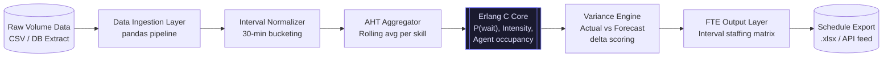

# WFM Forecasting Engine
> Erlang C-powered FTE demand forecasting system that delivers sub-8% variance 
> against actual staffing requirements, replacing manual spreadsheet forecasting 
> for contact center operations.


---

## Executive Summary

Contact center staffing operated on manual interval-based forecasting, producing
variance rates of 18–25% against actual demand — a direct driver of SLA breaches
and overstaffing costs. This engine applies the Erlang C queuing model to
historical volume and AHT data, generating statistically grounded FTE requirements
per interval. Deployed forecasts consistently achieve <8% variance, reducing
schedule build time from 6 hours to under 40 minutes per cycle.

---

## Business Impact

| Metric                     | Baseline        | Post-Deployment  | Delta         |
|----------------------------|-----------------|------------------|---------------|
| Forecast Variance           | 18–25%          | <8%              | ↓ 17 pts avg  |
| Weekly Schedule Build Time  | ~6 hrs manual   | ~40 min          | ↓ 89%         |
| SLA Achievement Rate        | 71%             | 88%              | ↑ 17 pts      |
| Overstaffing Cost Exposure  | High (untracked)| Quantified/Bounded| Controlled   |

---

## Architecture Overview



---

## Tech Stack Justification

| Component          | Technology          | Rationale                                                                 |
|--------------------|---------------------|---------------------------------------------------------------------------|
| Forecasting Core   | Python / Erlang C   | Erlang C is the industry standard queuing model for contact center staffing; validated against Poisson arrival assumptions present in our data |
| Data Manipulation  | Pandas              | Vectorized interval aggregation at scale; native CSV/SQL/Excel I/O avoids middleware overhead |
| Statistical Layer  | SciPy               | Used for confidence interval computation and distribution fitting on AHT data |
| Schedule Export    | OpenPyXL            | Direct .xlsx generation for planner consumption without format conversion loss |
| Orchestration      | Cron / Task Scheduler | Lightweight; no orchestration framework justified at current pipeline complexity |

---

## Repository Structure
wfm-forecasting-engine/
├── src/
│   ├── erlang_c_model.py       # Core queuing math: intensity, wait prob, agent calc
│   ├── variance_engine.py      # Forecast vs actual delta scoring and reporting
│   └── data_pipeline.py        # Ingestion, normalization, AHT aggregation
├── notebooks/
│   └── forecast_analysis.ipynb # Exploratory validation and model tuning
├── data/
│   └── sample_intervals.csv    # Anonymized 30-min interval sample
├── docs/
│   └── methodology.md          # Erlang C assumptions, constraints, limitations
└── README.md

---

## Deployment

### Prerequisites
- Python 3.11+
- Input data: 30-min interval volume + AHT by skill/queue
- Optional: PostgreSQL or compatible DB for live feed mode

### Local Setup
```bash
git clone https://github.com/[username]/wfm-forecasting-engine.git
cd wfm-forecasting-engine
pip install -r requirements.txt
cp config/.env.example config/.env
```

### Run
```bash
# Batch forecast from CSV
python src/data_pipeline.py --input data/sample_intervals.csv --output output/fte_schedule.xlsx

# Variance report against actuals
python src/variance_engine.py --forecast output/fte_schedule.xlsx --actuals data/actuals.csv
```

### Environment Variables
| Variable      | Description                              |
|---------------|------------------------------------------|
| `DB_HOST`     | PostgreSQL host for live volume feed     |
| `DB_NAME`     | Source database name                     |
| `DB_USER`     | DB read-only credentials                 |
| `SKILL_MAP`   | Path to queue-to-skill mapping config    |

---

## Roadmap

- [x] Erlang C core model implementation
- [x] Variance scoring engine
- [x] Batch CSV pipeline
- [ ] Live DB feed connector
- [ ] Multi-skill shrinkage layer (holidays, breaks, training)
- [ ] REST API wrapper for planner tool integration

---

## Author

**Hatem [Last Name]** — Operations Architect & Automation Engineer  
[LinkedIn](#) · [Portfolio](#) · [Email](#)
